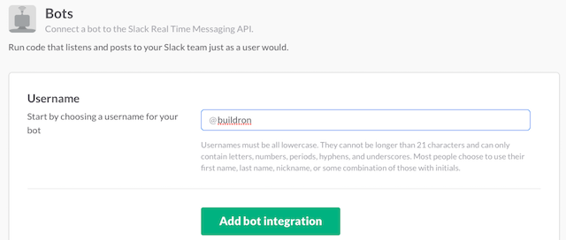
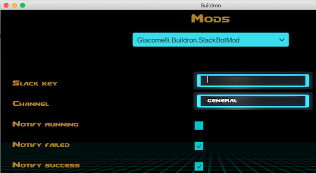
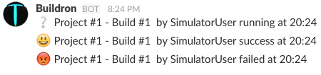
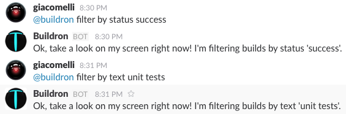
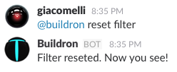
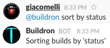
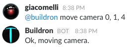
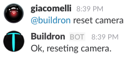
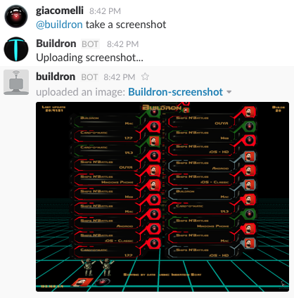

# Buildron.SlackBotMod


Mod that adds a bot to your Slack that acts as [Buildron](https://github.com/skahal/buildron) and your team can interact with it, like filter builds, sort builds, move camera, receive build status change notifications and taking screenshots.

### Installation
Download it from our [release page](https://github.com/giacomelli/Buildron.SlackBotMod/releases) and unzip it on your [Buildron mods folder](https://github.com/skahal/Buildron/wiki/Mods-Introduction#mods-folder).

### Configuration
Go to your [Slack team new bot page](http://my.slack.com/services/new/bot) and create a new bot called "buildron" and click in "Add bot integration"


In the next page copy the "API token". We need to set it on mod preferences inside Buildron.


Open Buildron and go to Giacomelli.Buildron.SlackBotMod [preferences](https://github.com/skahal/Buildron/wiki/Mods-Introduction#mods-preferences):


Paste the previous copied API Token on "Slack key" field.

Go back to Buildron main screen and start it.


### Usage

#### Status changed notifications
Your team can be notified by Buildron about builds status changed. In the mod preferences you can choose what status you want to receive notifications (running|succes|failed).



### Filter builds
Filter buils by status or text.



### Reset filter
Reset previous builds filter (no filter).



### Sort builds
Sort buils by status, text or date.



### Move camera
Move the camera the amount of pixels define in the x,y,z coordinates.



### Reset camera
Reset the camera position.



### Take a screenshot
Take a screenshot of current Buildron state.




> You can talk with Buildron bot in a specified channel choosed on mod preferences or on its direct message channel.

### FAQ
* Do you want to know more available Buildron bot messages?

type:

```shell
@buildron help
``` 

* Having troubles? 

Ask on Twitter [@ogiacomelli](http://twitter.com/ogiacomelli).
 
 
### How to improve it?

Create a fork of [Buildron.SlackBot](https://github.com/giacomelli/Buildron.SlackBotMod/fork). 

Did you change it? [Submit a pull request](https://github.com/giacomelli/Buildron.SlackBotMod/pull/new/master).


### License
Licensed under the The MIT License (MIT).
In others words, you can use this library for developement any kind of software: open source, commercial, proprietary and alien.
